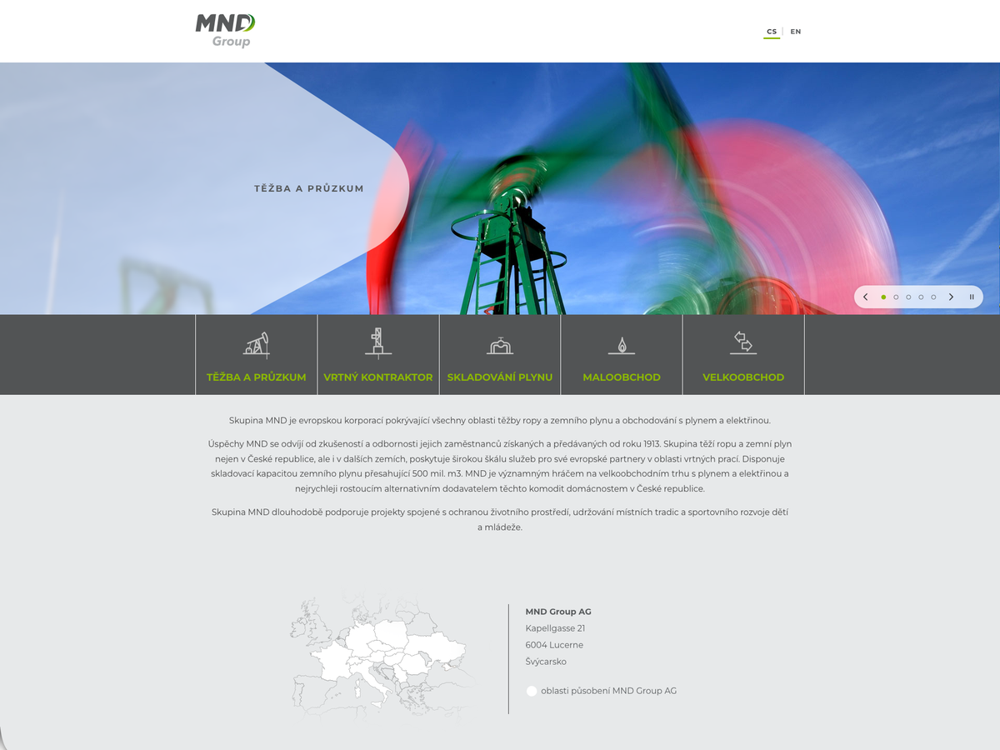

# MND Group — WordPress šablona a plugin

[](https://github.com/elvisek2020/wp-theme_mndgroup/releases/latest)


Vlastní šablona a doprovodný plugin pro rozcestník skupiny MND [www.mndgroup.eu](https://www.mndgroup.eu) — vzhled původní šablony z roku 2018, ale rychlé, bez jQuery, bez build kroku a bez externích služeb (Google Analytics jen se souhlasem návštěvníka).



| Balíček | Typ | Popis |
|---|---|---|
| **MND Group** (`theme/mndgroup`) | šablona | vzhled webu: bannery, dlaždice se společnostmi, text, patička s mapou, čeština a angličtina; SEO, GA4 s cookie lištou, česká typografie |
| **MND Group Core** (`plugins/mndgroup-core`) | plugin | funkce nezávislé na šabloně: přihlášení, bezpečnost, WebP, sitemap, aktualizace, údržba |

Obojí se vydává společně se stejným číslem verze a aktualizuje se přímo z GitHub Releases.

---

## Šablona MND Group

**Vzhled**
- Stejný vzhled jako původní šablona: hlavička s logem, bannery s bílým „šípem“, tmavé dlaždice se zelenými popisky a ikonami, šedý text a patička s mapou
- Bannery jako prezentace (prolínání, tečky, pauza, swipe, klávesnice) nebo všechny pod sebou
- Dlaždice oblastí podnikání se seznamem společností – na počítači po najetí myší, na mobilu a tabletu rozbalovací šipkou
- Přepínač jazyků CS / EN (Polylang), odkaz vede na překlad aktuální stránky
- Responzivní od 320 px, bannery i na mobilu

**Obsah**
- **SEO**: meta description ze stručného výpisu stránky (jinak ze začátku textu), Open Graph s jazykovými verzemi, karta pro X, strukturovaná data organizace a webu; s aktivním SEO pluginem se nic nevypisuje dvakrát
- **Google Analytics 4 s cookie lištou**: bez vyplněného ID se nenačte nic; s ID se návštěvníkům zobrazí lišta Přijmout / Odmítnout a Google se načte až po souhlasu (Consent Mode v2), volbu jde změnit odkazem „Nastavení cookies“ v patičce; ID se při přechodu samo převezme z MonsterInsights
- **Česká typografie**: pevné mezery za jednopísmennými předložkami (k, s, v, z), mezi číslem a jednotkou („500 mil.“, „10 %“), v číslech a za řadovou číslovkou – předložka nezůstane na konci řádku; jen v české verzi (náhrada pluginu Zalomení)
- Bannery jako typ obsahu *Slidy* s pořadím a jazykovou verzí, dlaždice a společnosti z menu, adresa v patičce z widgetu

**Technicky**
- Hybridní šablona: PHP šablony a `theme.json`, moduly v `inc/` jdou vypnout jednotlivě
- Žádné jQuery ani knihovny, vlastní skript 7 kB (+ 3 kB cookie lišta, jen s vyplněným ID GA4); úvodní stránka 9 požadavků / 237 kB (původní 33 / 4,8 MB)
- Písmo Montserrat lokálně (z `theme.json`), žádné Google Fonts ani CDN
- Přístupnost: kontrast WCAG AA, ovládání klávesnicí, popisky pro čtečky, respektuje „omezit pohyb“
- Kompatibilní s obsahem původní šablony (typ obsahu `slide`, menu `primary`, widgety `sidebar-footer`) – po aktivaci převezme menu v Polylangu a uklidí widgety

**Nastavení** — *Vzhled → Přizpůsobit → MND Group*

| Volba | Popis |
|---|---|
| Bannery na úvodní stránce | prezentace / všechny pod sebou |
| Interval střídání | 3–20 s |
| Logo KKCG | v patičce na velkých obrazovkách |
| Google Analytics 4 | ID měření (prázdné = bez měření i bez lišty) |

Bannery se spravují v *Slidy* (název + obrázek 1920 × 484 px, pořadí polem *Pořadí*), dlaždice a společnosti ve *Vzhled → Menu*, adresa v patičce ve *Vzhled → Widgety*, popis stránky pro vyhledávače v *Stránky → Upravit → Stručný výpis*.

---

## Plugin MND Group Core

Nahrazuje 3 dřívější pluginy (All-In-One Security, Simple Login Log, Server IP & Memory Usage) a funguje nezávisle na šabloně. Každou funkci jde zapnout a vypnout v *Nastavení → MND Group Core* (výchozí stav = vše zapnuté).

| Oblast | Co dělá |
|---|---|
| Přihlášení | omezení pokusů (výchozí 5 za 15 min → blokace IP na 30 min, další blokace 2× déle), obecné chybové hlášky, log přihlášení, poslední přihlášení v seznamu uživatelů |
| Bezpečnost | vypnuté XML-RPC a pingbacky, zakázaný editor souborů, skrytý výčet uživatelů (`?author=`, REST, oEmbed), skrytá verze WordPressu, bezpečnostní HTTP hlavičky (HSTS volitelně) |
| SEO | sitemap bez uživatelů a s datem poslední změny, `/llms.txt` – stručný přehled webu pro AI nástroje |
| Média | nahrané JPG a PNG se uloží jako WebP (otočené podle EXIF), zmenšeniny také ve WebP |
| Komentáře | úplně vypnuté včetně administrace a kanálů |
| Aktualizace | WordPress (všechny verze / jen opravné / vypnuto) a pluginy a šablony (všechny / podle volby) automaticky; šablona i plugin MND z GitHubu (nabídnou se, instalují se kliknutím) |
| Administrace | info o serveru v patičce administrace, widget **Zdraví webu** na Nástěnce: verze a aktualizace, databáze, autoload, uploads, přihlášení, poslední údržba |

**Údržba webu** — *Nástroje → Údržba webu*
- Přehled systému (WordPress, PHP, databáze, verze šablony a pluginu)
- Převod starších obrázků na WebP: všechny velikosti, odkazy v obsahu, staré adresy přesměrované (301), originály do karantény
- Databáze: velikost tabulek, autoload a největší volby, optimalizace
- Úklid revizí, automatických konceptů, koše, prošlých transientů a osiřelých metadat
- Největší soubory, nepoužité obrázky (jen ke kontrole) a rozbité interní odkazy
- Úklid po odebraných pluginech a staré šabloně: tabulky, volby a složky se přesunou do karantény (volby se zálohují do JSON), smazání karantény je samostatné tlačítko
- Log přihlášení a rušení blokací (*Nástroje → Log přihlášení*)

---

## Požadavky

- WordPress 6.5+ (testováno do 7.1)
- PHP 7.4+ (připraveno na 8.5)
- Polylang (volitelně, pro přepínání jazyků)

## Instalace

1. Stáhněte `mndgroup.zip` a `mndgroup-core.zip` z [posledního vydání](https://github.com/elvisek2020/wp-theme_mndgroup/releases/latest).
2. *Pluginy → Přidat nový → Nahrát plugin* → `mndgroup-core.zip` → Aktivovat.
3. *Vzhled → Motivy → Přidat nový → Nahrát motiv* → `mndgroup.zip` → Živý náhled → Aktivovat.

## Aktualizace

Šablona i plugin si nové vydání najdou samy. Stačí *Nástěnka → Aktualizace → Zkontrolovat znovu* a aktualizovat.

---

## Vývoj

```
theme/mndgroup/           šablona (podrobnosti v theme/mndgroup/README.md)
plugins/mndgroup-core/    plugin
dev/                      lokální WordPress v Dockeru a kontrola stránek Playwrightem (dev/README.md)
tools/                    pomocné skripty v Pythonu: REST klient a příprava obrázků
.github/workflows/        sestavení vydání
mu-plugins/ docs/         pomůcky pro vývoj a interní plán – v gitu nejsou
```

**Lokální prostředí** — WordPress v Dockeru na `http://localhost:8321`, šablona a plugin jsou do kontejneru připojené přímo z repozitáře (bez kopírování). Návod v [`dev/README.md`](dev/README.md).

**Nástroje** — přístup k webu přes REST API účtem s rolí Editor a aplikačním heslem v `ctime.txt` (sekce „WordPress API“, v gitu není). Obsah se zakládá a upravuje jen jako koncept, publikuje člověk.

```bash
tools/wp.py whoami                    # ověření přístupu
tools/wp.py pages                     # stránky ve všech jazycích
tools/wp.py slides                    # bannery
tools/wp.py draft --type page --title "…" --content text.html --excerpt "…"
tools/img.py                          # obrazky/vstup → obrazky/web (WebP 1920 × 484, ořez na banner)
tools/img.py --size 1600x900          # jiný formát
```

Zálohy, přístupové údaje a interní dokumenty se neverzují.

## Vydání nové verze

Šablona i plugin mají společnou verzi.

1. Zvyšte `Version:` v `theme/mndgroup/style.css` **i** v `plugins/mndgroup-core/mndgroup-core.php` a doplňte [`CHANGELOG.md`](CHANGELOG.md).
2. Ověřte lokálně (`dev/tests` → `npm test`).
3. Commit a anotovaný tag:
   ```bash
   git add -A && git commit -m "X.Y.Z: …"
   git status                      # musí být čisto
   git tag -a vX.Y.Z -m "X.Y.Z" && git push && git push --tags
   ```
4. GitHub Action ověří, že tag odpovídá verzím, zkontroluje syntaxi PHP (i 7.4) a JS, sestaví `mndgroup.zip` a `mndgroup-core.zip` a vytvoří Release.

## Licence

[GPL-2.0-or-later](https://www.gnu.org/licenses/gpl-2.0.html) · © Zdeněk Král ([ElvisEK](https://www.elvisek.cz)) · písmo Montserrat: [SIL OFL 1.1](theme/mndgroup/assets/fonts/OFL.txt)
